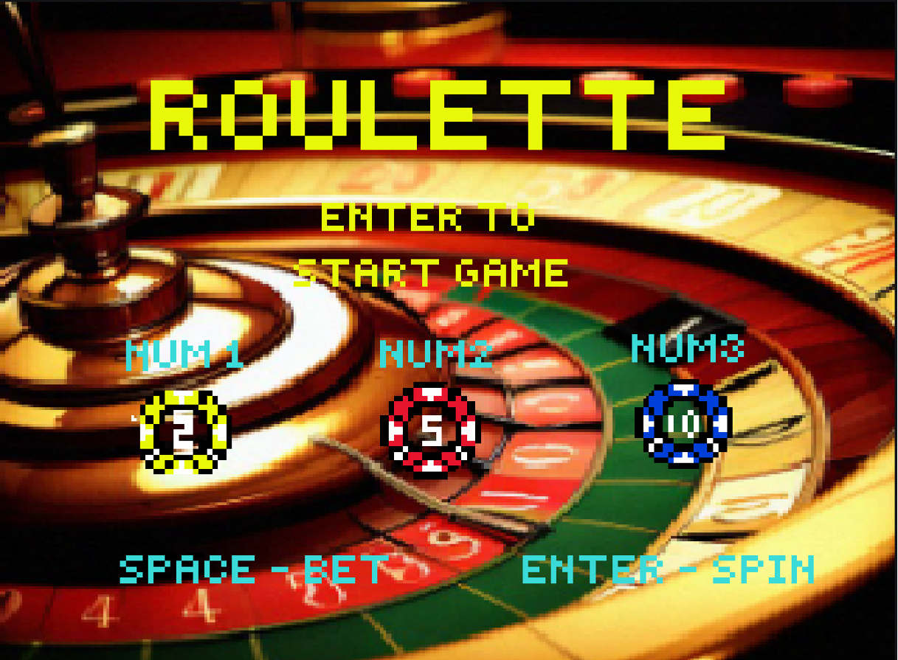

# Interactive Virtual Roulette Game

## Overview
This project presents an interactive simulation of a traditional roulette game, incorporating various betting systems and strategies. Users can place bets on different outcomes and update game displays based on the result, providing an intuitive understanding of roulette game mechanics, payout ratios, and betting strategies in a virtual environment.

## Features
- **Loading Screen**: Introduces user input keys for efficient user interaction.
  - Press 1, 2, 3: Choose the betting amount
  - Space: Place a bet
  - Enter: Start the roulette
- **Betting System**: Place bets on single numbers, colors, even/odd, and groups of numbers with multiple bets per spin.
- **Randomized Outcome Generation**: Ensures each spin is independent and unpredictable.
- **Payout Calculation**: Calculates winnings based on traditional roulette payout ratios.
- **Balance Management**: Tracks the user's bankroll, updating based on game outcomes.
- **User Interface**: Displays the betting table, balance, and bet amounts, with immediate feedback on results.
- **Result and Gameover Display**: Shows the winning number, color, and total credits won or lost. Game restarts when the balance is below 0.

## Challenges and Solutions
- **PS2 Mouse Detection**: Initial challenges with PS2 mouse input led to switching to a PS2 keyboard for consistent user input detection.

## Future Enhancements
- Add roulette animation for spinning.
- Integrate sound effects for an enhanced player experience.
- Implement mouse clicks for easier navigation.
- Add history of roulette results to aid strategic betting.

## Conclusion
This project allows players to experience the excitement of roulette with the convenience of virtual gameplay, serving as both an entertaining game and an educational tool for understanding roulette mechanisms and betting strategies.

## Project Report
For a detailed project report, please refer to [Roulette_Game_Project_Report.pdf](Roulette_Game_Project_Report.pdf).
